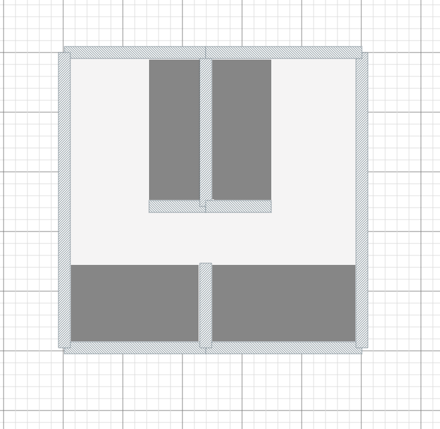
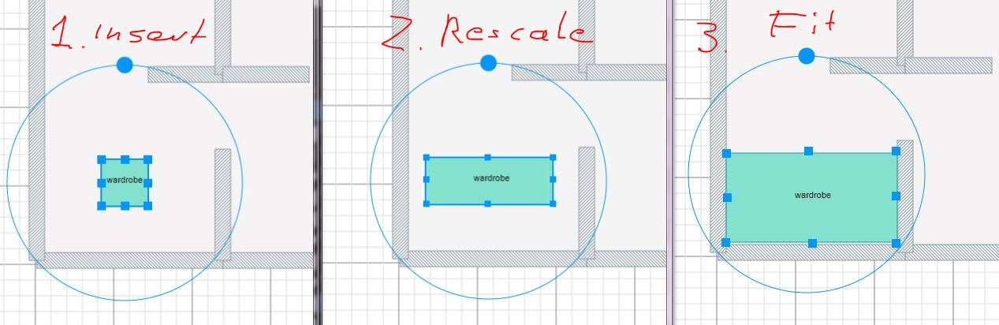
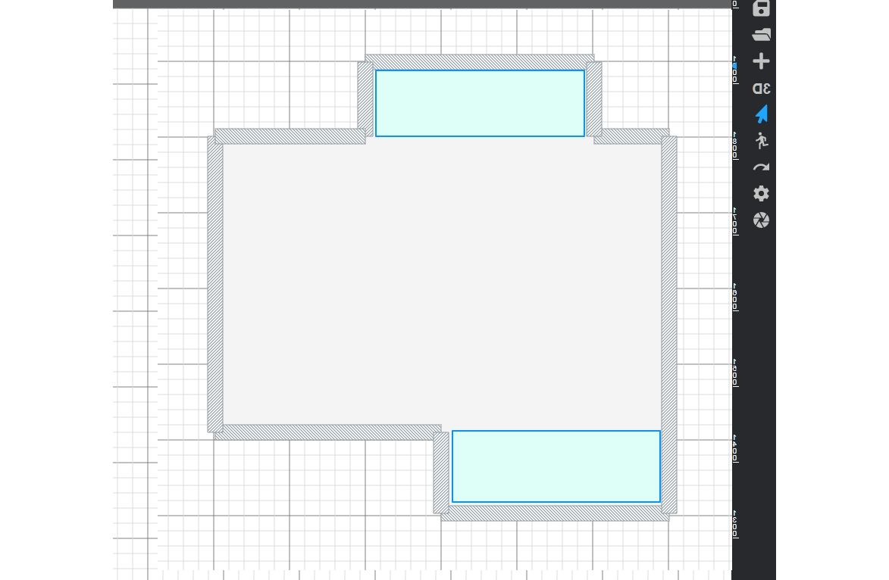

# 16-Wardrobe_element

[Development repository](https://github.com/homyplan/react-planner-alt)

Prepare BuiltIn wardrobe component.
- Create Insert builtin wardrobe button to enter insert element mode
- In insert mode allow for both walls beeing selected to spread wardrobe between them.
- Add depth slider to chande wardrobe depth
- Two wardrobe can share the same wall as shown at Fig: Wardrobe_02
- Depth slider modifies grey part of the wardrobe, but ideally with back wall detected. I mean only front of the wardrobe is moving with slider. 
- There are All wardrobe parameters accessible by the user (Width, Depth, Height). The only important parameter is depth if width will be automatically detected. If this is not possible, there is a need for a way to input them from UI. Fig: Wardrobe_03. We were thinking about alternative access to parameters, so kind of on-screen controllers can be developed. When wardrobe is selected (or just created) there are controllers apear, allowing for rescale and rotate wardrobe (You can expand existing rotate widget with scale handles Fig. Wardrobe_04)
- Ideally it can adapt to the shortest wall (and following wall move), but lets be realistic, and let us know how much work this functionality will add to overall schedule. It can be independent of the walls, or just follow wall movement (and not length).
Take shortest wall length, but if this will be difficult we can consider stages of wardrobe creation: - firtst normal drawing/putting on the scene, then rescaling to fit or automatic fit. Fig Wardrobe_04 is trying to describe the process: first normal drawing of the wardrobe, then rescaling with widgets and finally fit the gap by hand. Let us know if this approach can be applied.
If You implement wardrobes inserted with stages (insert-rescale-fit), they can overlap. Then user will change size an position to fit the gap. L shape wardrobe is not an option.
The thing is, that builtin wardrobe is "a special kind of wardrobe" and it will be taken into consideration for calculation (not like other furniture), so there is a need to connect it with a wall gap. Room cannot be a wardrobe nor just two or three walls. Fig 05 shows a special case where there is no additional dividing walls, but builtin wardrobe can be inserted (due to existance of wall gaps)
In the future deleting wall connected with the wardrobe will trigger the popup with warning. For now You can delete a wardrobe with the wall.

[Figma mockup](https://www.figma.com/file/lEGBrtmHrIjOwbRCBT2yhE/Wardrobe?node-id=0%3A1)

[Slideshow PDF](Wardrobe.pdf)
