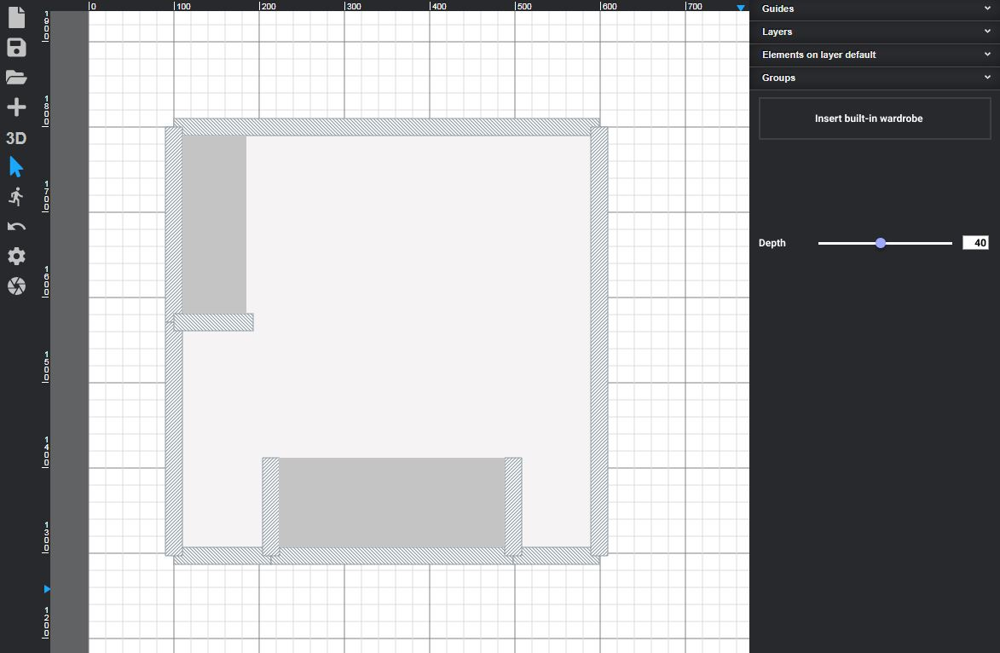

# 16-Wardrobe_element

Prepare BuiltIn wardrobe component.
- Create Insert builtin wardrobe button to enter insert element mode
- In insert mode allow for both walls beeing selected to spread wardrobe between them.
- Add depth slider to chande wardrobe depth

[Figma mockup](https://www.figma.com/file/lEGBrtmHrIjOwbRCBT2yhE/Wardrobe?node-id=0%3A1)

[Slideshow PDF](Wardrobe.pdf)
